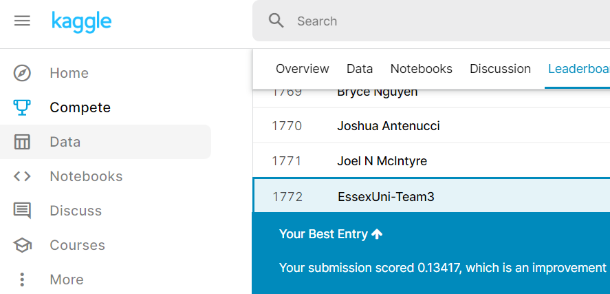

# predictHousePricesTeamProject

## The project revolved around an entry for a kaggle competition

## We made a website for interacting with the model

### The website uses php to run the script.py

